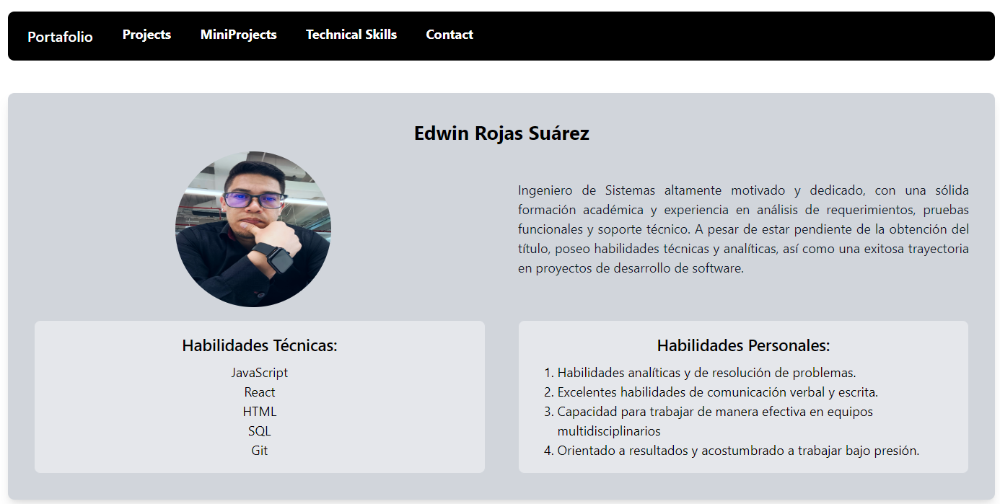
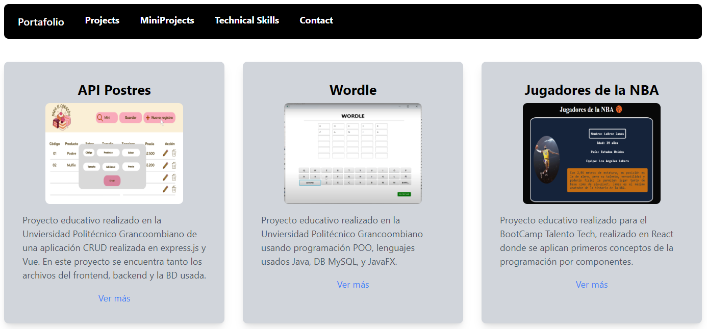
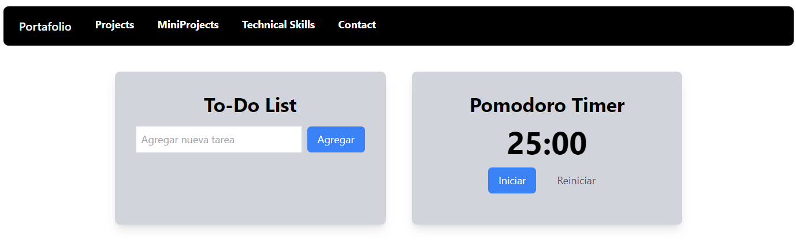
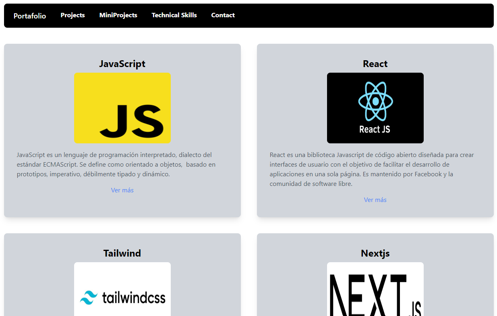
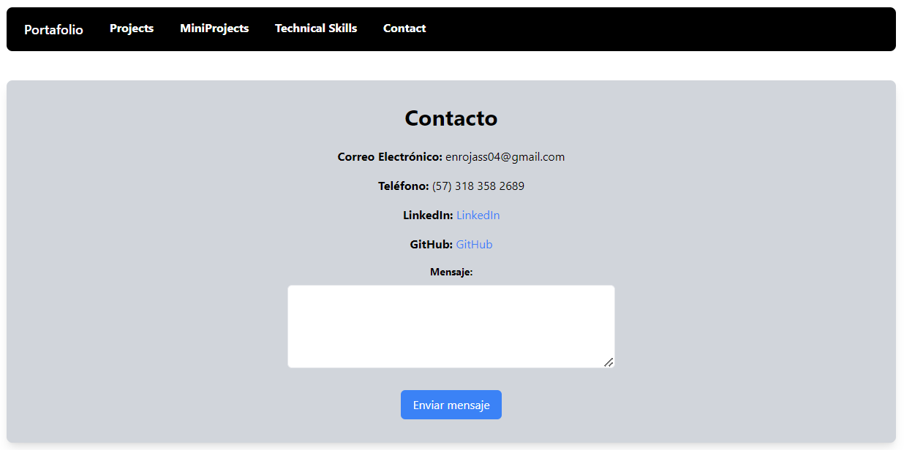

# Nombre del Proyecto

Reto de programación 1 BootCamp Talento Tech.

## Tecnologías Utilizadas

- React
- Vite
- Tailwind

## Capturas de Pantalla







## Primeros pasos

Primero, ejecuta el servidor de desarrollo:

```bash
npm run dev
# o
yarn dev
# o
pnpm dev
# o
bun dev
```

Abra [http://localhost:5173/](http://localhost:5173/) con su navegador para ver el resultado.

## Estilo con Tailwind CSS

Este proyecto utiliza Tailwind CSS para el estilo. Puedes personalizar los estilos modificando el archivo `tailwind.config.js`. Para obtener más información, consulta la [documentación de Tailwind CSS](https://tailwindcss.com/docs).

## Más Información

Para obtener más información sobre React, Vite y Tailwind CSS, consulta los siguientes recursos:

- [Documentación de React](https://reactjs.org/docs) - aprende sobre las características y la API de React.
- [Documentación de Vite](https://vitejs.dev/guide) - explora las características y configuración de Vite.
- [Documentación de Tailwind CSS](https://tailwindcss.com/docs) - entiende las utilidades y configuración de Tailwind CSS.

